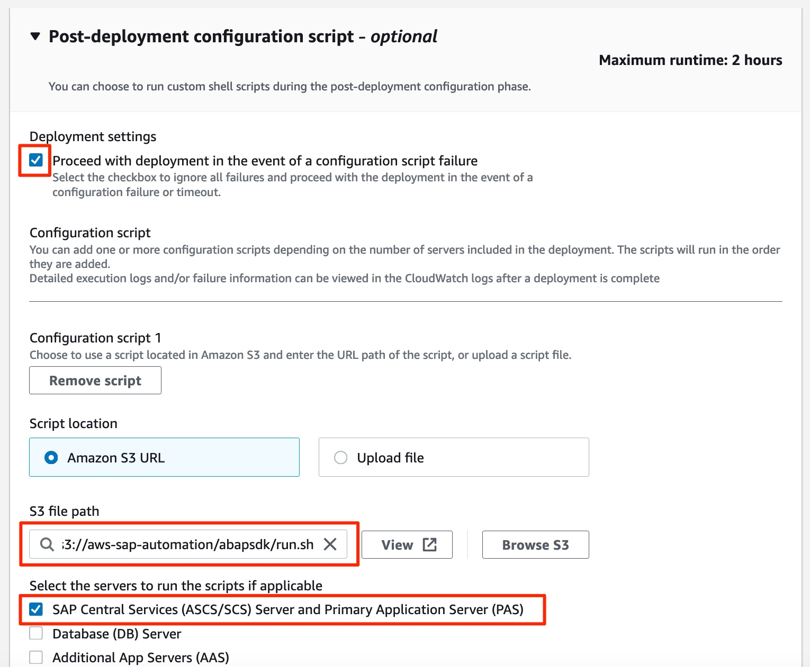

# AWS SDK for SAP ABAP installer

Performs the following steps:
1. Downloads, validates, unpacks and copies the AWS SDK for SAP ABAP's transport files to their designated location for further processing (mode=downloadandcopy)
2. (Optional) Adds all transport files to the SAP system's transport buffer (mode=addtobuffer)
3. (Optional) Imports the ABAP SDK's **core** transport (mode=importcore)

Additional transports can be imported manually as needed. For brand new installations, the script generates a minimal 
transport profile, so that all transports are readily available after setting up SAP transaction STMS. 

## Prerequisites (Once only)

- Create and attach the provided [IAM Policy](iam_policy.json) to role **AmazonEC2RoleForLaunchWizard**

## New LW4SAP deployments

In AWS Launch Wizard for SAP, proceed to **Configure deployment model**. 
In section **Post-deployment configuration script**, choose the following Amazon S3 URL as script location:

```bash
s3://aws-sap-automation/abapsdk/run.sh
```

or, in case for download and copy to 'usr/sap/trans' only

```bash
s3://aws-sap-automation/abapsdk/run_downloadandcopyonly.sh
```

In case of a distributed deployment, choose **ASCS/SCS/PAS** as target server. 

The result looks as follows, the error message "Invalid S3 Bucket" can be ignored:



Click 'next' to complete the wizard.

## Existing LW4SAP deployments

Navigate to AWS Systems Manager → Documents and hit **Create document**. Choose a name and copy and paste the following Content

```yml
description: ''
schemaVersion: '2.2'
mainSteps:
- action: aws:runShellScript
  name: 'RunTagging'
  inputs:
    runCommand:
    - aws s3 cp s3://aws-sap-automation/abapsdk/run.sh ./ --region eu-central-1
    - chmod +x run.sh
    - ./run.sh
```

To save, press **Create document**.  

Next, locate your document and press **Run command**. Select your target EC2 instances and press **Run**.

Wait until the command has completed successfully. In case the command failed, check the command output/error directly for more information!

## Run standalone

To run the script standalone, simply execute the following command:

```bash
./lw_abapsdk.sh standalone { downloadandcopy | addtobuffer | importcore } sapsid=<###> client=<###> pf=/path/to/custom/transport.pfl
```

'client' and 'pf' are optional parameters!

Example:

```bash
./lw_abapsdk.sh standalone downloadandcopy sapsid=S4H
```

## Troubleshooting

- Check [Launch Wizard Post-deployment script Log](https://docs.aws.amazon.com/launchwizard/latest/userguide/launch-wizard-sap-troubleshooting.html#launch-wizard-sap-troubleshooting-scripts)

## Considerations

- The script comes with two runmodes, "lwpostscript" for post-script deployment with the AWS Launch Wizard for SAP and "standalone" for use with already fully operating SAP systems
- Currently, all ABAP SDK transports are added to the SAP system's transport queue, which means 350+ individual transports
- If available, an existing transport profile can be provided in both modes (highly recommended for "standalone" mode)
- The ABAP SDK core transport is imported into client 000 by default, an alternative client can be passed via commandline (standalone mode)
- Transports are imported with **Ignore Invalid Component Version** and **Overwrite Originals** options set