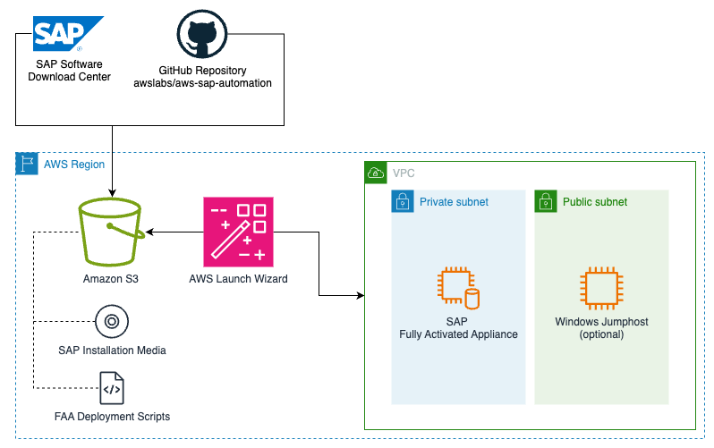

# Automated installation of SAP S/4HANA Fully-Activated Appliance (FAA) using AWS Launch Wizard (LW)

Installs an SAP S/4HANA Fully-Activated Appliance (FAA) running on an Amazon EC2 instance deployed using AWS Launch Wizard

**Important:** Kindly consult [SAP Note 2041140 - Order an SAP S/4HANA fully-activated appliance for on-premise deployment](https://me.sap.com/notes/2041140) for details regarding SAP's licensing and usage requirements before proceeding with the deployment.

*Note: The installation package currently supports installation of the SAP S/4HANA 2023 FPS00 Fully-Activated Appliance only*

## Prerequisites (Once only)

- A VPC which can be used for the EC2 instance deployment has to be existent. 
- The SAP S/4HANA Fully-Activated Appliance 2023 FPS00 installation media and the SWPM must be stored in an S3 bucket (instructions see below).
- The default EBS volumes provisioned by Launch Wizard are not appropriately sized for an S/4HANA FAA installation. During the installation, the package increases the size of these volumes to accommodate the storage requirements for data, logs, and media of the FAA system. To enhance performance and reduce provisioning time, it also boosts throughput and IOPS, which can be manually scaled down after the installation. Attach the provided [IAM Policy](iam_s4h_faa_policy.json) to the **AmazonEC2RoleForLaunchWizard** role to grant the *ec2:ModifyVolume* permission.

For detailed instructions on setting up IAM for AWS Launch Wizard for SAP, refer to the [user guide](https://docs.aws.amazon.com/launchwizard/latest/userguide/launch-wizard-sap-setting-up.html#launch-wizard-sap-iam)

## Deployment Architecture

## Installation Flow

### Set up an S3 bucket to store the installation media files for SAP S/4HANA FAA, along with SWPM and post-deployment script

The installation media files for SAP S/4HANA FAA, along with the SWPM and post-deployment script needed for application deployment on the EC2 instance, should be transferred to an S3 bucket. This S3 bucket can be within the same AWS account or in a different account, provided that the necessary access permissions are properly set up.

Set up an AWS S3 bucket with the prefix *launchwizard-\** and create three folders within it -
- *exports* - For storing S/4HANA FAA installation media files
- *swpm* - For storing Software Provisioning Manager (SWPM)
- *post_deploy* - For storing the post-deployment script

### Prepare the necessary files

1. Download the [SAP S/4HANA 2023 FPS00 FAA](https://me.sap.com/softwarecenter/template/products/_APP=00200682500000001943&_EVENT=DISPHIER&HEADER=Y&FUNCTIONBAR=N&EVENT=TREE&NE=NAVIGATE&ENR=73554900100900005332&V=INST) installation media from [SAP Software Download Center](https://support.sap.com/en/my-support/software-downloads.html) using your SAP S-User ID and upload to *exports* S3 bucket folder

2. Similarly, download [Software Provisioning Manager(SWPM)](https://me.sap.com/softwarecenterviewer/73555000100200007684/MAINT) and upload to *swpm* S3 bucket folder

3. Download the automated [post-deployment script](post_deploy_s4h_faa.sh)

4. Modify the deployment script to set the required parameters -
- *s4h_faa_exports* - S3 URI path for S/4HANA fully-activated appliance .ZIP exports
- *s4h_swpm* - S3 URI path for SWPM .SAR file

5. Upload the modified script to *post_deploy* S3 bucket folder

### Deploy using AWS Launch Wizard

**Note:** Since the installation package manages the installation process for the SAP fully-activated appliance (which follows a different installation procedure than a standard SAP S/4HANA system), the following LW parameters are not used during the installation and would be ignored:
- SAPSYS Group ID
- SAP System ID
- SAP System Admin User ID
- HANA System ID
- HANA System Number

These parameters are predefined in the FAA installation and become available at the completion of the installation.

Refer to the user guide on [Deploying an SAP application with AWS Launch Wizard](https://docs.aws.amazon.com/launchwizard/latest/userguide/launch-wizard-sap-deploying.html) to set up an **infrastructure-only single-system SAP deployment**. Additionally, ensure that the *post_deploy_s4h_faa.sh* script is included in the post-deployment configuration scripts section. The FAA installation package supports LW deployment options via both the Console and AWS CLI. If you prefer AWS CLI, you can download the [sample JSON specification file](lwapi_s4h_faa.json) and customize it as per your needs before deployment.

Certain key parameters to be configured -
- **Application type:** Netweaver stack on HANA database
- **Deployment model:** Single instance deployment
- **Instance type:** r6i.4xlarge
- **SAP application & HANA installation:** No

The deployment is expected to take around 60 to 90 minutes. You can monitor the progress by checking the deployment log at **"/root/install/post_deploy.log"**. Once the deployment is complete, the log will display the SAP system details including master password.

## Troubleshooting

Each deployment in your account in the same AWS Region can be uniquely identified by the application name specified at the time of a deployment. The application name can be used to view the details related to the application launch. Please refer the [Troubleshoot AWS Launch Wizard for SAP](https://docs.aws.amazon.com/launchwizard/latest/userguide/launch-wizard-sap-troubleshooting.html) user guide for detailed troubleshooting options.

- All logs related to the LW deployment can be found at "/root/install/scripts/log/install.log" during the deployment process, and after completion, they are available at "/root/install/install.log"
- The FAA installation logs are always available at "/root/install/post_deploy.log" for monitoring progress.