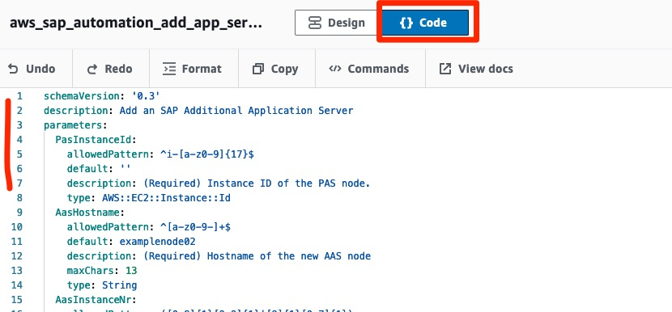

# Add additional application server (AAS) to existing SAP NetWeaver single or distributed installations

**Assumptions**

The following assumptions should be considered before proceeding with this procedure.

* All servers of the SAP application to which the node is being added are running.
* There are no upgrades or patching in progress.

**Steps for adding an AAS node to an existing NetWeaver installation**

Navigate to **AWS Systems Manager** → Shared Resources → Documents and hit **Create document** of type **Automation**. Switch from Design to Code and copy the contents of this [file](aas_add.yml) into the input area. Enter a name **aws-sap-automation-aas-add**.

To save, press **Create document**.

Next, locate your document and press **Execute automation**.

Specify the following parameters:

   * **(Required) PasInstanceId** — Select EC2 Instance ID of the Primary Application Server (PAS) node
   * **(Required) AasAmiId** — Select the AMI to provision the additional application server. You must use the most recent version of the AMI created from the source deployment.
   * **(Required) AasHostname** — Enter the hostname the new SAP node will be using.
   * **(Required) AasInstanceNr** — Enter the instance number of the additional application server.
   * **(Required) AasInstanceType** — Enter the EC2 instance type.
   * **(Required) AasSubnetId** — Enter the desired VPC subnet.
   * **(Optional) PrivateIp** — Select the private IP address to assign to the new instance.
   * **(Optional) Ec2KeyPair** — Select a key pair to securely connect to your instance.
   * **(Optional) AasSecurityGroup** — Select a security group that is currently assigned to a database node.

Under **PreDeploymentScript**, optionally add one or more configuration scripts, depending on the number of servers included in the deployment. The scripts run in the order they are added. You can view detailed execution logs or failure information in the Amazon CloudWatch logs after a deployment is complete.

Under **PostdeploymentScript**, optionally add one or more configuration scripts, depending on the number of servers included in the deployment. The scripts run in the order they are added. You can view detailed execution logs or failure information in the Amazon CloudWatch logs after a deployment is complete.

Once completed, press **Execute**. Wait until the command has completed successfully. In case the command failed, check the command output/error directly for more information!

**Workflow for adding an additional application server (AAS) node**

When you add an additional SAP server to your existing NetWeaver distributed installation, depending on whether you provide a PAS or AAS image, the file systems and volumes are adjusted to the requirements of the additional application server. The script performs the following:

1. An instance is created using the provided AMI.
2. The hostname is updated when the instance boots.
3. All abandoned services and processes are cleaned up.
4. /etc/hosts is updated on the master node, and then the hosts file is synced to the new node.
5. If the provided AMI is from the Primary Application Server (PAS) and Launch Wizard detects the /sapmnt volume in /etc/fstab/, the volume is unmounted and removed. /sapmnt is mounted as an NFS from the PAS.
6. If pre-deployment configuration scripts are provided, they are run.
7. .env files are updated and a new instance profile file is created.
8. SAP Services are started.
9. The SAP instance is started.
10. If post-deployment configuration scripts are provided, they are run.

**Manual activities recommended**

When the automation workflow runs, the new node is attached to the existing SAP application and is reflected in the SAP console (SM51). The following manual activities are recommended to successfully add an AAS node to an existing NetWeaver installation. The following steps are presented as general guidelines and may not be complete for your scenario.

* Host entries are updated only on the PAS and newly added nodes. Refresh /etc/hosts entries from the PAS on all of the other existing nodes.
* Upload and set system profiles using transaction RZ10.
* Configure the number of work processes.
* Adjust or create logon and RFC server groups using transactions SMLG and RZ12.
* Adjust or create operation modes using transaction RZ04.
* Configure the virtual/overlay IP, if applicable

**Delete an additional application server (AAS) from an existing NetWeaver installation:**

**Note:** You can only delete a node that was created with the add node feature here. Before you delete an AAS node, verify that no users are logged in and no jobs are running on the instance. Then, make sure to stop the SAP application server properly.

Navigate to AWS Systems Manager → Shared Resources → Documents and hit **Create document** of type **Automation**. Switch from Visual to Code and copy the contents of this [file](aas_remove.yml) into the input area. Enter a name **aws-sap-automation-aas-remove**.

To save, press **Create document**.

Next, locate your document and press **Execute Automation**. Specify the parameters and press **Execute**.

Wait until the command has completed successfully. In case the automation failed, check the output/error of the respective commands directly for more information!