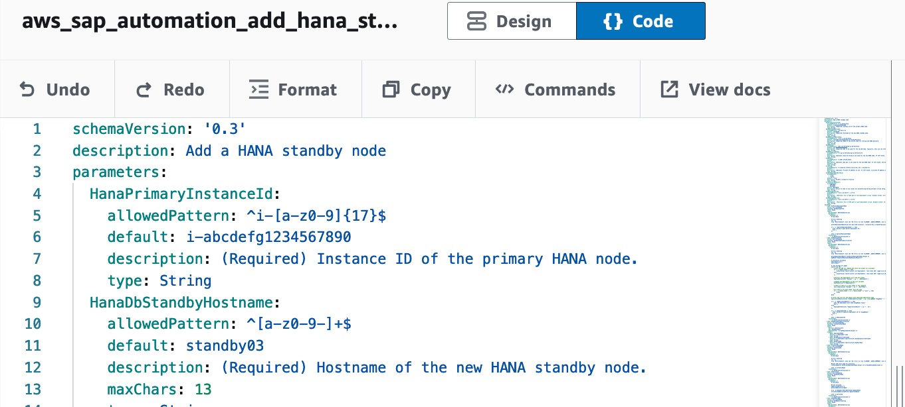

# Add additional SAP HANA standby node to an existing HANA scale-out cluster

**Assumptions**

The following assumptions should be considered before proceeding with this procedure.

* A standby node is ONLY possible if the parent deployment is made using FSx for ONTAP file system.
* A standby node will be created using the same instance type as an existing standby node. Verify that all of the standby nodes are running on the same Amazon EC2 instance type.
* All HANA nodes and respective services are up and running.
* There are no upgrades or patching in progress.
* No maintenance activities, such as backups, are in progress.

**Steps for adding SAP HANA worker**

Navigate to **AWS Systems Manager** → Shared Resources → Documents and hit **Create document** of type **Automation**. Switch from Design to Code and copy the contents of this [file](hana_standby_add.yml) into the input area. Enter a name **aws-sap-automation-hana-standby-add**.

To save, press **Create document**.

Next, locate your document and press **Execute automation**.

Specify the following parameters:

   * **(Required) HanaPrimaryInstanceId** — Select EC2 Instance ID of the primary HANA node
   * **(Required) HanaDbAmiId** — Select the AMI to provision the additional HANA server. You must use the most recent version of the AMI created from the source deployment.
   * **(Required) HanaDbStandbyHostname** — Enter the hostname the new SAP node will be using.
   * **(Required) HanaDbPasswordSecretKey** — Name of the secret used for storing the HANA password.
   * **(Optional) PrivateIp** — Select the private IP address to assign to the new instance.
   * **(Optional) Ec2KeyPair** — Select a key pair to securely connect to your instance.
   * **(Optional) HanaDbSecurityGroup** — Select a security group that is currently assigned to a database node.

Under **PreDeploymentScript**, optionally add one or more configuration scripts, depending on the number of servers included in the deployment. The scripts run in the order they are added. You can view detailed execution logs or failure information in the Amazon CloudWatch logs after a deployment is complete.

Under **PostdeploymentScript**, optionally add one or more configuration scripts, depending on the number of servers included in the deployment. The scripts run in the order they are added. You can view detailed execution logs or failure information in the Amazon CloudWatch logs after a deployment is complete.

Once completed, press **Execute**. Wait until the command has completed successfully. In case the command failed, check the command output/error directly for more information!

**Workflow for adding a HANA standby node**

When you add an additional HANA standby node to your existing HANA scale-out installation, Launch Wizard for SAP performs the following:

1. An instance is created using the provided AMI.
2. The hostname is updated when the instance boots.
3. /etc/hosts is updated on the master node, and then the host file is synced to the newly created node.
4. All abandoned services and processes are cleaned up.
5. If pre-deployment configuration scripts are provided, they are run.
6. /usr/sap, /hana/data, and /hana/log are not cleaned up. New Amazon FSx volumes on a new FSx for ONTAP file system along with storage virtual machines for log and data volumes will be created and mounted on the newly created instance.
7. saphostagent is set up.
8. The HANA standby node is set up using add_hosts.
9. If post-deployment configuration scripts are provided, they are run.

**Manual activities recommended**

The following manual activities are required to successfully add a HANA standby node to an existing scale-out installation.

* For FSx for ONTAP based deployments, you must mount the newly created FSx for ONTAP volumes for hana-data and hana-log on all the database nodes.

**Delete the SAP HANA standby node**

**Note:** You can only delete a node that was created with the add node feature here.

Navigate to AWS Systems Manager → Shared Resources → Documents and hit **Create document** of type **Automation**. Switch from Visual to Code and copy the contents of this [file](hana_standby_remove.yml) into the input area. Enter a name **aws-sap-automation-hana-standby-remove**.

To save, press **Create document**.

Next, locate your document and press **Execute Automation**. Specify the parameters and press **Execute**.

Wait until the command has completed successfully. In case the automation failed, check the output/error of the respective commands directly for more information!