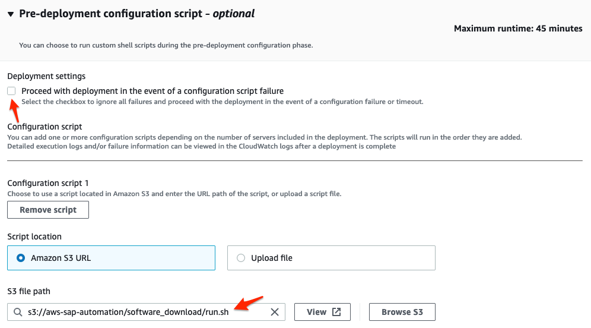
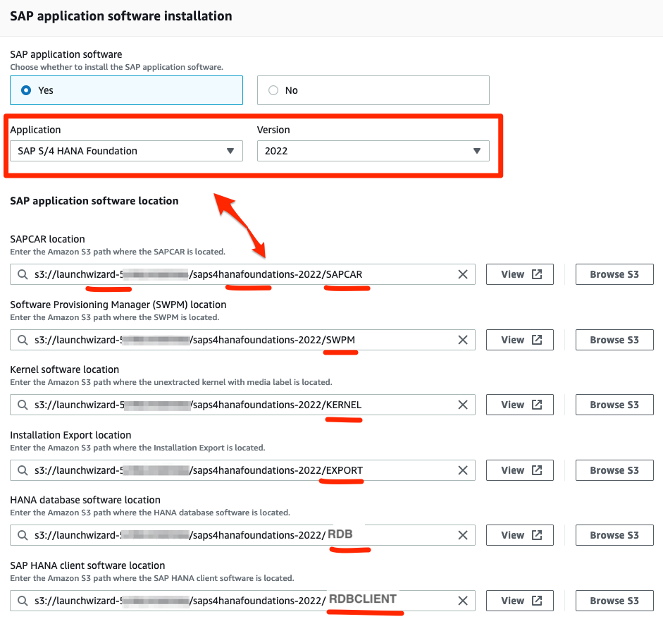

# SAP Software Download

Fetches all required artifacts from SAP Software Center to execute AWS Launch Wizard for SAP deployments.
**Note:** Requires valid SAP-S-User to be maintained in AWS Secrets Manager.

## Prerequisites (Once only)

- Create new Amazon S3 Bucket **launchwizard-`<AWSAccountID>`** (Note: Bucket Name must contain 'launchwizard' as prefix)
- Create and attach the provided [IAM Policy](iam_policy.json) to role **AmazonEC2RoleForLaunchWizard**
- Create a new secret called **sap-s-user** in AWS Secrets Manager (use default AWS Managed KMS key)
  - Store S-User -> property **username**
  - Store Password -> property **password**
- (Optional) Create VPC Endpoint for S3 for faster upload to S3 and to save on data transfer costs

## Usage via AWS Launch Wizard for SAP

In AWS Launch Wizard for SAP, proceed to **Configure deployment model**. 
In section **Pre-deployment configuration script**, choose the following Amazon S3 URL as script location:

```bash
s3://aws-sap-automation/software_download/run.sh
```

Make sure to **untick** "Proceed with deployment in the event of a configuration script failure"



---

Next, specify the **SAP application software location** and use the following naming convention:
- s3://launchwizard-`<AccountID>`/`<SAP_PRODUCT_ID>`/SAPCAR
- s3://launchwizard-`<AccountID>`/`<SAP_PRODUCT_ID>`/SWPM
- s3://launchwizard-`<AccountID>`/`<SAP_PRODUCT_ID>`/KERNEL
- s3://launchwizard-`<AccountID>`/`<SAP_PRODUCT_ID>`/EXPORT
- s3://launchwizard-`<AccountID>`/`<SAP_PRODUCT_ID>`/HANADB
- s3://launchwizard-`<AccountID>`/`<SAP_PRODUCT_ID>`/HANADBCLIENT



---

Supported **SAP_PRODUCT_ID**s, as per AWS Launch Wizard for SAP, are

- sapNetweaver-750
- sapNetweaverJavaOnly-750
- sapNetweaver-752
- sapbw4hana-2021
- sapbw4hana-2.0
- saps4hana-1909
- saps4hana-2020
- saps4hana-2021
- saps4hana-2022
- saps4hanafoundations-2021
- saps4hanafoundations-2022
- sapsolman-7.2

All done!

## Usage via Shell e.g. AWS Cloud9

**Note:** Make sure to allocate enough disk space of at least 20-30 GB!

### Initialize

```bash
cd /
mkdir aws-sap-automation
cd aws-sap-automation
aws s3 cp s3://aws-sap-automation/software_download/ ./software_download --recursive
aws s3 cp s3://aws-sap-automation/utils/ ./utils --recursive
chmod +x utils/colors.sh
chmod +x utils/lw_bootstrap.sh
chmod +x software_download/lw_software_download.sh
cd software_download
```

### Validate download links only

```bash
./lw_software_download.sh validate <SAP_PRODUCT_ID>
```

Example:
```bash
./lw_software_download.sh validate saps4hana-2021
```

### Download and store software in S3 only

```bash
./lw_software_download.sh download <SAP_PRODUCT_ID> s3://launchwizard-<AccountID>/<SAP_PRODUCT_ID>
```

Example:
```bash
./lw_software_download.sh download saps4hana-2021 s3://launchwizard-346724746423/saps4hana-2021
```

## End-to-End testing

**Note:** Can only be run on an EC2 instance, deployed by AWS Launch Wizard for SAP!

```bash
./lw_software_download.sh
```

## How to update SWDC Links

- Go to [SAP Support Launchpad](https://me.sap.com/softwarecenter)
- Search for file(s) e.g. SWPM
- Filter by **Linux on x86_64 64bit**
- Locate latest file and click on **Content Info**
- Note and replace MD5 Hash as well Object ID in [links.csv](links.csv)

## Troubleshooting

- [CloudWatch Log](https://docs.aws.amazon.com/launchwizard/latest/userguide/launch-wizard-sap-troubleshooting.html#launch-wizard-sap-logs)
- [Pre-deployment script Log](https://docs.aws.amazon.com/launchwizard/latest/userguide/launch-wizard-sap-troubleshooting.html#launch-wizard-sap-troubleshooting-scripts)
- [S3 Bucket setup](https://docs.aws.amazon.com/launchwizard/latest/userguide/launch-wizard-sap-structure.html)
- [SAP stacks supported by AWS LW](https://docs.aws.amazon.com/launchwizard/latest/userguide/launch-wizard-sap-software-install-details.html)

## Considerations

- **SAP S-User passwords expire after 6 months** and have to be changed in the SAP Me Portal, otherwise the script will throw a "Username/Password Authentication Failed." error
- SAP Installation files are currently being **downloaded into the DB instance’s provisioned Amazon EFS share for staging**, folder name is '/media/LaunchWizard-\<LW_Deployment_Name\>'. Each file is uploaded immediately after download, and then deleted from the local storage. This should work for all stacks as the largest file is currently the HANA binary (14.3 GB).
- Certain download links like **SAPCAR**, **SWPM** and **HANADB** should be checked frequently due to SAP taking the files offline as soon as new patch levels are released. Links to the DVD installer files are more stable but will be taken offline as well once the respective product is being deprecated
- Download links for the various software products have been taken from https://docs.aws.amazon.com/launchwizard/latest/userguide/launch-wizard-sap-software-install-details.html. For some components, newer versions have been considered.
- The filenames are fetched via a HEAD request (wget), which might slow things down for larger amounts of files, especially since the **SAP download server sends 2-3 redirects** for certain download links
- Since all files are currently being downloaded into the EFS share and uploaded into S3 afterwards, an **S3 VPC Endpoint** is highly recommended for performance and cost efficiency.
- The longest runtime of about 20-30 minutes is observed for the s4hana2021 stack (Note: Launch Wizard caps overall pre-script runtime at 45 minutes).
- Launch Wizard places the pre-deployment scripts in **/root/install/scripts** on the respective host and names them 'preConfiguration-\<number\>'
