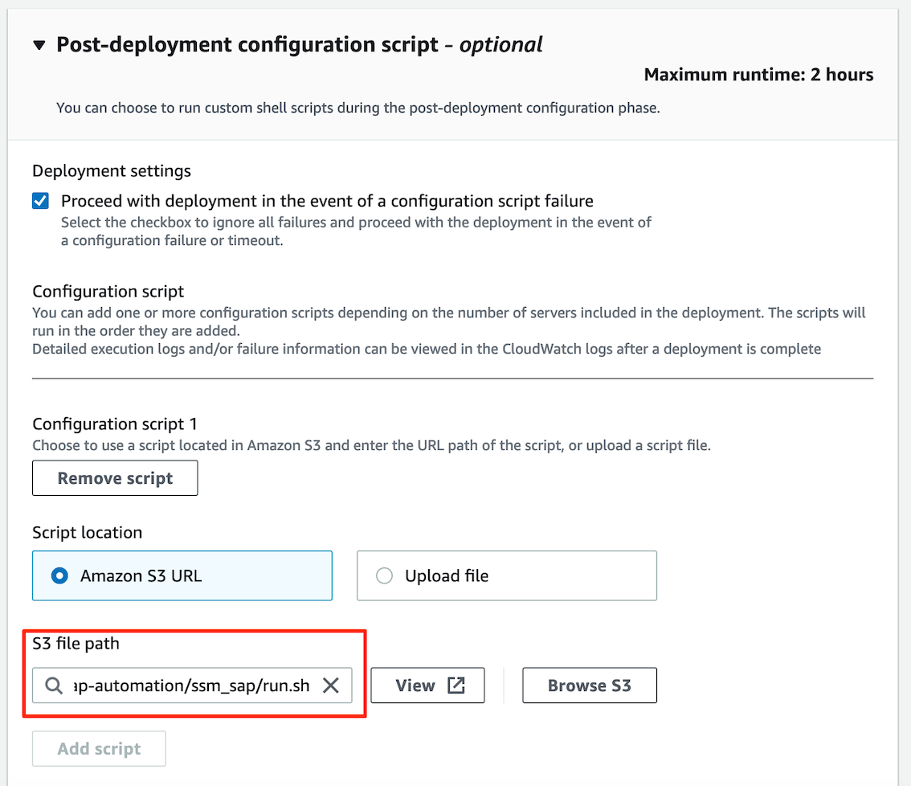
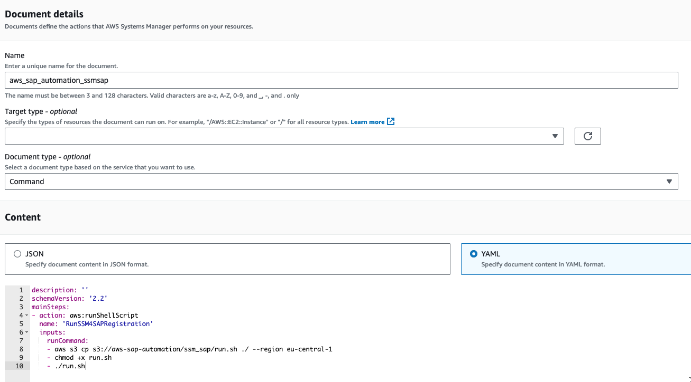
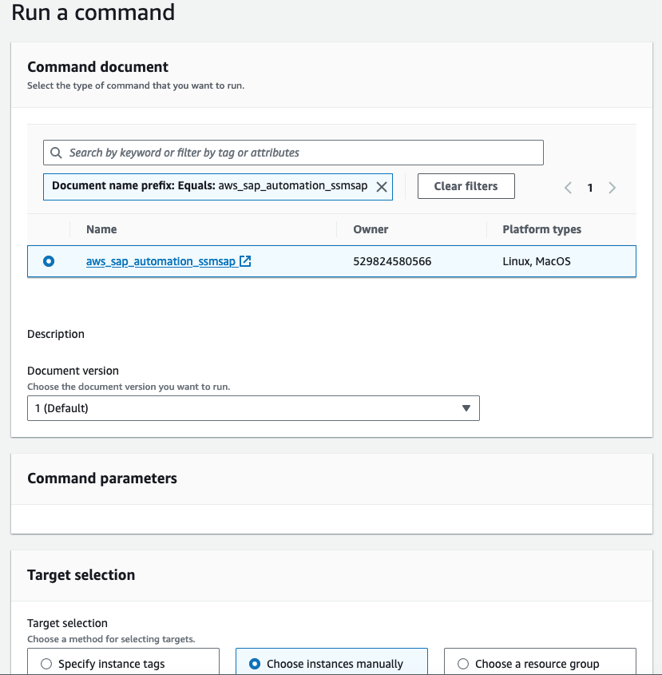

# AWS Systems Manager for SAP Registration

Registers SAP HANA database and/or SAP ABAP Application Server **single-node** deployments as part of Launch Wizard for SAP (LW4SAP) with [AWS Systems Manager for SAP](https://docs.aws.amazon.com/ssm-sap/latest/userguide/get-started.html) (SSM4SAP).

## Prerequisites (Once only)

- Attach the **AWSSystemsManagerForSAPFullAccess** policy to role **AmazonEC2RoleForLaunchWizard**
- Create and attach the provided [IAM Policy](iam_policy.json) to role **AmazonEC2RoleForLaunchWizard**

## New LW4SAP deployments:

In AWS Launch Wizard for SAP, proceed to **Configure deployment model**. 
In section **Post-deployment configuration script**, choose the following Amazon S3 URL as script location:

```bash
s3://aws-sap-automation/ssm_sap/run.sh
```

The result looks as follows. Click 'next' to complete the wizard.



## Existing LW4SAP deployments:

Navigate to AWS Systems Manager → Documents and hit **Create document**. Choose a name and copy and paste the following Content

```yml
description: ''
schemaVersion: '2.2'
mainSteps:
- action: aws:runShellScript
  name: 'RunSSM4SAPRegistration'
  inputs:
    runCommand:
    - aws s3 cp s3://aws-sap-automation/ssm_sap/run.sh ./ --region eu-central-1
    - chmod +x run.sh
    - ./run.sh
```

To save, press **Create document**.  



Next, locate your document and press **Run command**. Select your target EC2 instances and press **Run**.



Wait until the command has completed successfully. In case the command failed, check the command output/error directly for more information!

## Troubleshooting

- Check [Launch Wizard Post-deployment script Log](https://docs.aws.amazon.com/launchwizard/latest/userguide/launch-wizard-sap-troubleshooting.html#launch-wizard-sap-troubleshooting-scripts)
- Check [SSM for SAP - Run Command Log](https://eu-central-1.console.aws.amazon.com/systems-manager/run-command/executing-commands?region=eu-central-1)
- You can run 'aws ssm-sap deregister-application --application-id \<SAP_SID\>' to re-register

## Considerations

- Currently only single-node HANA-based deployments are supported!
- SAP Application Server registration depends on saphostctrl information
- By default, you can only register up to 10 applications in AWS Systems Manager for SAP per AWS Account per AWS Region. For more make sure to increase your [quota](https://docs.aws.amazon.com/general/latest/gr/ssm-sap.html#limits_ssm-sap).