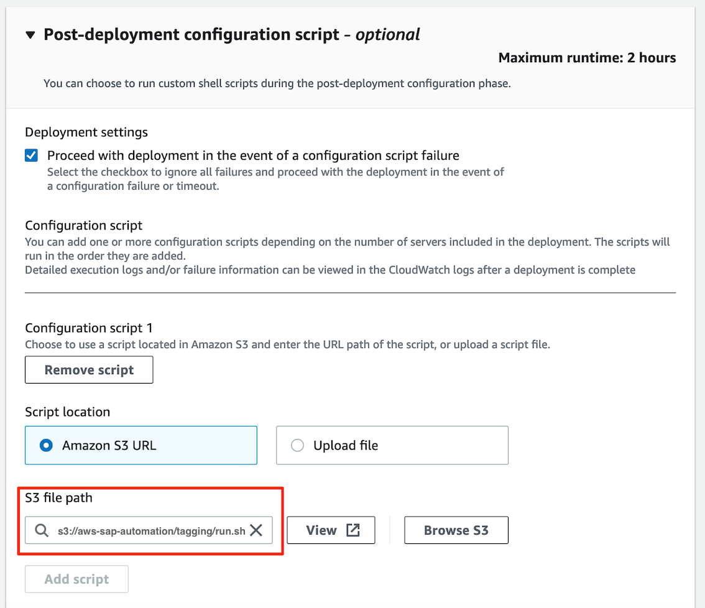

# Add custom tags

Adds a set of predefined custom tags to all AWS Launch Wizard for SAP deployment resources.

## Prerequisites (Once only)

- Navigate to AWS Systems Manager -> Parameter Store: [Create](https://console.aws.amazon.com/systems-manager/parameters/aws/create) a new parameter called **sap-custom-tags**, Type **StringList**, Value must be key=value pairs one line each ([Example](customtags.txt))
- Create and attach the provided [IAM Policy](iam_policy.json) to role **AmazonEC2RoleForLaunchWizard**

## New LW4SAP deployments:

In AWS Launch Wizard for SAP, proceed to **Configure deployment model**. 
In section **Post-deployment configuration script**, choose the following Amazon S3 URL as script location.:

```bash
s3://aws-sap-automation/tagging/run.sh
```

In case of a distributed deployment, choose **ASCS/SCS/PAS** AND **AAS** as target server. 

The result looks as follows, the error message "Invalid S3 Bucket" can be ignored:



Click 'next' to complete the wizard.

## Existing LW4SAP deployments:

Navigate to AWS Systems Manager → Documents and hit **Create document**. Choose a name and copy and paste the following Content

```yml
description: ''
schemaVersion: '2.2'
mainSteps:
- action: aws:runShellScript
  name: 'RunTagging'
  inputs:
    runCommand:
    - aws s3 cp s3://aws-sap-automation/tagging/run.sh ./ --region eu-central-1
    - chmod +x run.sh
    - ./run.sh
```

To save, press **Create document**.  

Next, locate your document and press **Run command**. Select your target EC2 instances and press **Run**.

Wait until the command has completed successfully. In case the command failed, check the command output/error directly for more information!

## Troubleshooting

- Check [Launch Wizard Post-deployment script Log](https://docs.aws.amazon.com/launchwizard/latest/userguide/launch-wizard-sap-troubleshooting.html#launch-wizard-sap-troubleshooting-scripts)

## Considerations

- Each resource can have up to 50 tags. For other limits, see [Tag Naming and Usage Conventions](https://docs.aws.amazon.com/tag-editor/latest/userguide/tagging.html#tag-conventions) in the AWS General Reference.
- Resource Group Tagging 'tag-resources' API, supports only 20 resources at a time
- Tagging CloudFormation Stack managed resources runs into error (DynamoDB staging table no longer exists after deployment) and hence is ignored
- Once executed successfully, you may cleanup the artifacts in directory **/tmp/aws-sap-automation**